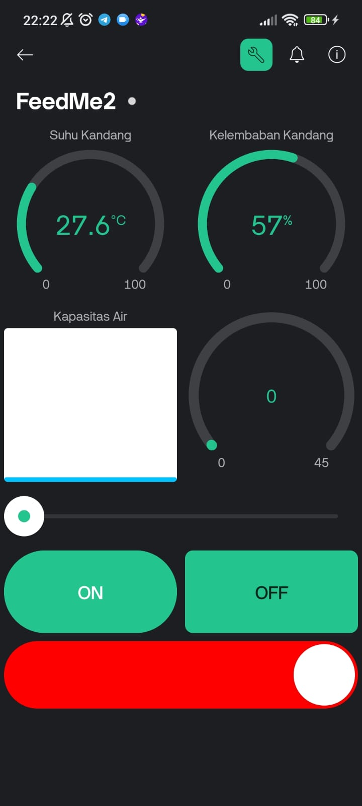
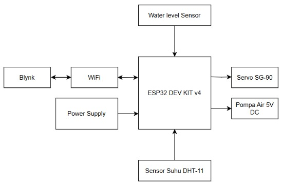
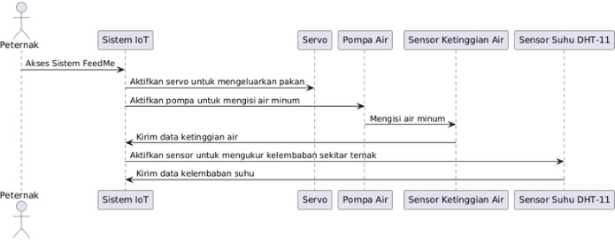
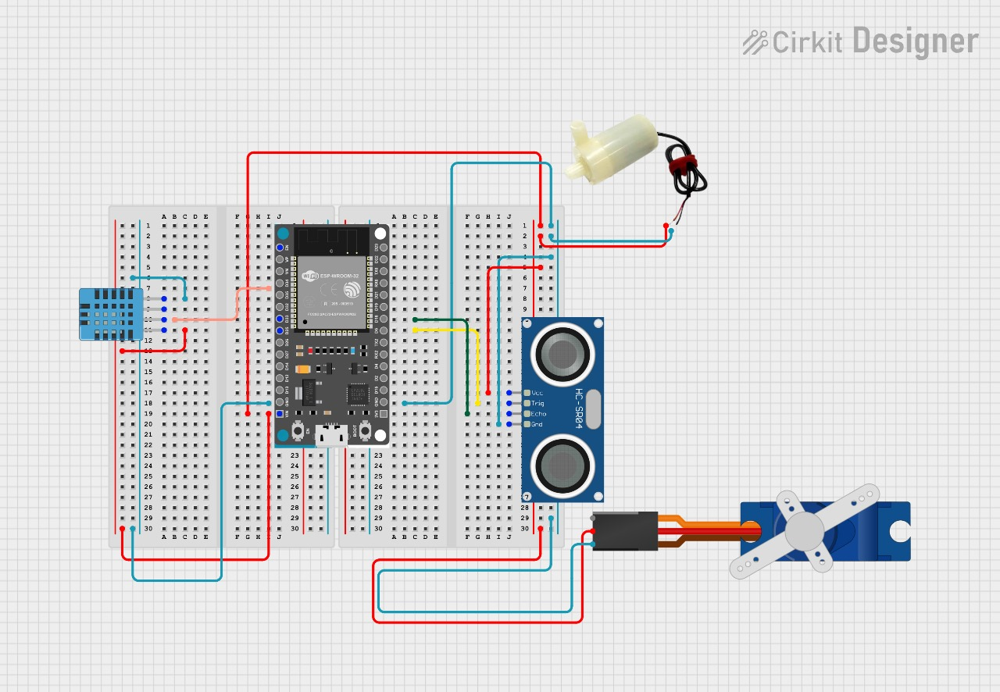

# FeedMe! - Automation of Animal Feed & Water Feeding for Modern Chicken Farm based on IoT

## Project Domain
The project is focuses on IoT based for automatically feed and drink with actuator and also can detect temperature in real time with sensor.

## Table Of Contents
- [Background](#background)
- [Hardware Specifications](#hardware-specifications)
- [System Diagram](#system-diagram)
- [Software Installation](#software-installation)
- [Demo and Evaluation](#demo-and-evaluation)
- [Conclusion](#conclusion)
- [Team](#team)

---

## Background

### Problem Statements
1. Feeding and watering chickens is still performed manually, requiring the farmer's constant physical presence.
2. Farm management is inefficient in terms of time and energy due to repetitive daily tasks.
3. The temperature inside the chicken coop is unpredictable and not consistently monitored, which can negatively affect chicken health and growth.
   
### Goals
1. Automate the feeding and watering process with remote control and scheduling via a mobile app.
2. Improve time and energy efficiency for the farmer, allowing focus on other productive activities.
3. Enable real-time monitoring of the coop's temperature to maintain an ideal environment.

### Solution Statements
1. Build an IoT-based automatic feeding and watering system using actuators like servo motors and waterpump.
2. Develop a mobile application to serve as a control dashboard for scheduling, manual commands, and monitoring.
3. Integrate a temperature sensor (e.g., DHT11) to provide real-time environmental data on the mobile app.
4. Use an ESP32 microcontroller to control the entire system, including sensors, actuators, and Wi-Fi connectivity.

---

## Prerequisites

### Hardware Specifications

- **Microcontroller:** ESP32 DEV KIT v4
- **Sensors:** Temperature Sensor (DHT 11) & Water Level Sensor
- **Actuators:** Servo motor (SG90) & Waterpump (5V)
- **Switching:** Relay (5V)
- **Connectivity:** WiFi
- **Power Supply:** 5V Powerbank

### ESP32 Datasheet

### Blynk User Interface

## System Diagram

1. **Block Diagram**
   
2. **Sequence Diagram**
   
3. **Schematic**
   

## Demo and Evaluation

## Conclusion
This IoT project can save cost, time, and effort for chicken farmers. Its automatic features can provide benefits for chicken farmers. With this product we can also bring a better life with future technology. As long as we can use this product well, we can develop chicken farming with better techniques and provide better efficiency for other activities.

## Team
